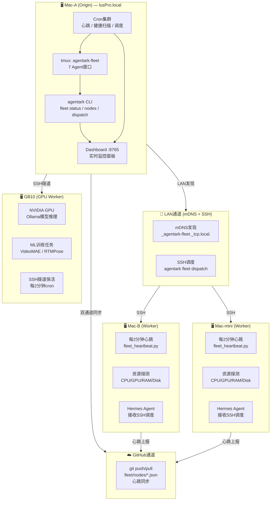
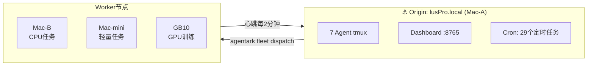
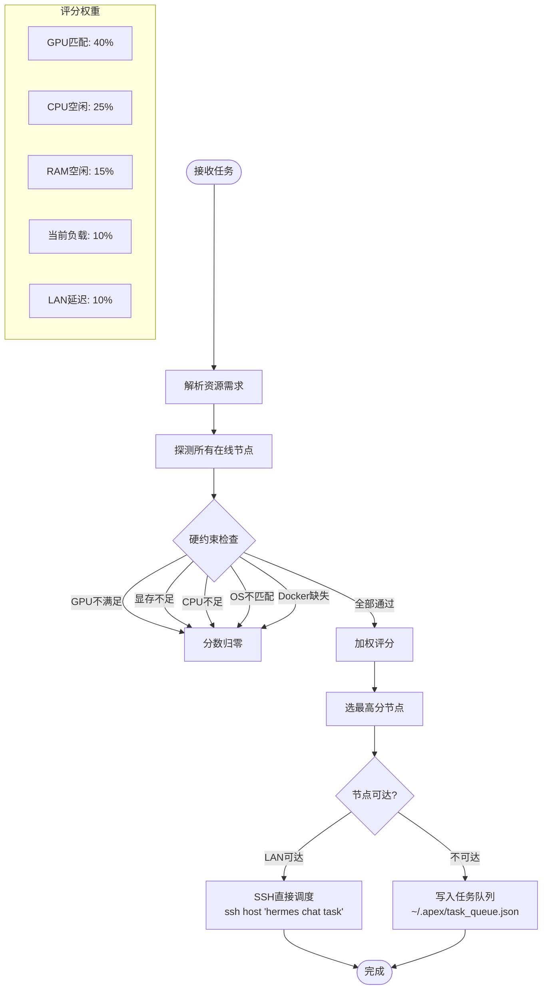
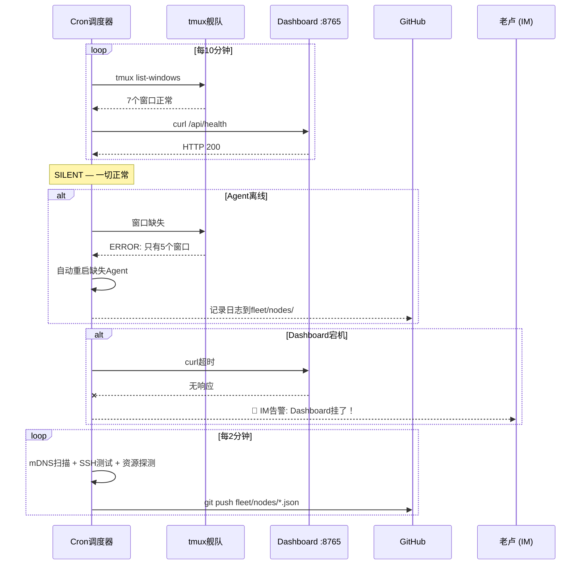

# 老卢舰队 — Demo 演示文档

> 跨机器多Agent舰队 — 一台Origin + N台Worker，LAN发现 + GitHub同步双通道，资源感知调度

---

## 架构图



## 舰队拓扑



## 5分钟Demo演示

```bash
# ===== Step 1: 舰队状态总览 =====
agentark fleet status
# 输出：45 agents, 4 项目, 7 tmux窗口, 101 技能

# ===== Step 2: 查看所有节点 =====
agentark fleet nodes
# 输出：5台节点（含时间戳、角色、心跳状态）

# ===== Step 3: LAN发现邻居 =====
agentark fleet lan scan
# 输出：4秒内发现局域网内所有Worker节点

# ===== Step 4: 本机资源探测 =====
agentark fleet probe
# 输出：CPU 16核、64GB RAM、1TB 磁盘、Apple M4 GPU

# ===== Step 5: 干跑任务调度 =====
agentark fleet dispatch "分析用户数据" --cpu-cores 8 --dry-run
# 输出：评分矩阵，显示哪个节点最适合执行

# ===== Step 6: Dashboard实时监控 =====
open http://localhost:8765
# 展示：Token用量、Agent进程、Claude会话、14天趋势图
```

## 舰队命令速查

```
┌─────────────────────────────────────────────────────────────────────┐
│  🚢 舰队管理 (Fleet Management)                                       │
├─────────────────────────────────────────────────────────────────────┤
│  agentark fleet status                   舰队全局状态                  │
│  agentark fleet nodes                    节点列表(角色/心跳/项目)       │
│  agentark fleet probe                    本机硬件探测                   │
│  agentark fleet init-fleet               初始化Origin舰队               │
│  agentark fleet init                     启动tmux多Agent舰队            │
├─────────────────────────────────────────────────────────────────────┤
│  📡 LAN组网                                                            │
├─────────────────────────────────────────────────────────────────────┤
│  agentark fleet lan scan                 快速扫描LAN邻居(4秒)           │
│  agentark fleet lan discover             持续发现(后台运行)             │
│  agentark fleet dispatch <task> [flags]  跨机器任务调度                │
│    --gpu                                  需要GPU                     │
│    --gpu-memory-mb <MB>                   GPU显存要求                  │
│    --cpu-cores <N>                        CPU核心要求                  │
│    --ram-mb <MB>                          内存要求                    │
│    --target <hostname>                    指定目标机器                  │
│    --dry-run                              干跑(只评分不执行)            │
│  agentark fleet queue                    查看任务队列                  │
├─────────────────────────────────────────────────────────────────────┤
│  🖥️ tmux舰队操作                                                       │
├─────────────────────────────────────────────────────────────────────┤
│  tmux attach -t agentark-fleet                附加到舰队终端                │
│  tmux detach (Ctrl+B d)                   分离会话                     │
│  tmux list-windows -t agentark-fleet          列出所有Agent窗口             │
│  tmux send-keys -t agentark-fleet:pm "任务"   派发任务给PM                  │
│  tmux capture-pane -t agentark-fleet:pm -S -20 读取最后20行输出            │
│  tmux kill-window -t agentark-fleet:agent     关闭单个Agent                │
│  tmux kill-session -t agentark-fleet          关闭整个舰队                  │
└─────────────────────────────────────────────────────────────────────┘
```

## 调度评分算法



## 健康监控拓扑



## 实际运行截图（文字版）

```
$ agentark fleet nodes

  ⚓ 老卢舰队 ──── 5 节点

  ⚓  lusPro.local-luke ◀     ORIGIN  badminton-coac…  活跃  2026-07-04T00:00
                                       apex, finopsai
  💻  MacBook-Pro-2.…      WORKER  finopsai          上次  2026-06-28T23:00
                                       badminton-coac…
  💻  GB10.local-root       WORKER  gb10              上次  2026-06-28T22:45
  💻  parser-ubuntu.local   WORKER  badminton-coac…   上次  2026-06-28T21:30
  💻  parsimo-mac.local     WORKER  finopsai          上次  2026-06-28T20:15

  当前机器: lusPro.local-luke  角色: ORIGIN
```

```
$ agentark fleet status

  ⚓ 老卢舰队
  Agents: 45 total · 7 运行中 · 0 任务执行中
  项目:   4 (badminton-coach-ai, apex, finopsai, shenzhen-badminton)
  技能:   101
  节点:   5 (1 Origin · 4 Worker)
  心跳:   LAN ✅ · GitHub ⚠ (上次同步: 5分钟前)
```

## 舰队启动脚本（一键部署）

```bash
#!/bin/bash
# fleet-start.sh — 一键启动老卢舰队
set -e

AGENTS=(pm architect backend-dev frontend-dev devops qa-engineer github-release)
SESSION="agentark-fleet"
HERMES_BIN="hermes"

# 1. 杀旧舰队（如果存在）
tmux kill-session -t "$SESSION" 2>/dev/null || true

# 2. 创建新舰队
tmux new-session -d -s "$SESSION" -n "${AGENTS[0]}" -x 160 -y 40 \
  "$HERMES_BIN -p ${AGENTS[0]} chat"
echo "✅ 创建窗口: ${AGENTS[0]}"

# 3. 添加其余Agent
for agent in "${AGENTS[@]:1}"; do
  tmux new-window -t "$SESSION" -n "$agent" "$HERMES_BIN -p $agent chat"
  echo "✅ 创建窗口: $agent"
done

# 4. 验证
WINDOW_COUNT=$(tmux list-windows -t "$SESSION" | wc -l)
PROC_COUNT=$(ps aux | grep "hermes -p" | grep -v grep | wc -l)
echo ""
echo "🎉 老卢舰队已启动！"
echo "   窗口数: $WINDOW_COUNT"
echo "   进程数: $PROC_COUNT"
echo "   附加:   tmux attach -t $SESSION"
```

## 关键文件

| 文件 | 说明 |
|------|------|
| `docs/舰队运维手册.md` | 完整运维文档（8章） |
| `docs/舰队Demo.md` | 本文档（演示素材） |
| `fleet/fleet.json` | 舰队全局配置 |
| `fleet/nodes/*.json` | 节点心跳JSON |
| `scripts/fleet_heartbeat.py` | 双通道心跳脚本 |
| `scripts/gb10_tunnel_keepalive.sh` | GB10 SSH隧道保活 |

---

📖 完整文档: [docs/舰队运维手册.md](舰队运维手册.md)
